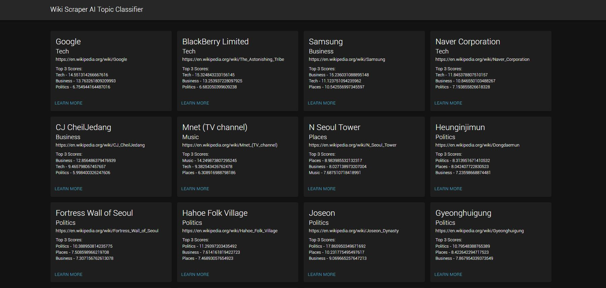

# Wikipedia Scraper & AI Topic Classifier

A Wikipedia web crawler, page scraper & AI Topic Classifier.

A full-stack development environment with ReactJS (bootstrapped with [Create React App]) as the frontend and Python Flask as the backend. 

Utilizes GloVe: Global Vectors for Word Representation (https://nlp.stanford.edu/projects/glove/) to power the AI topic classifier

<picture>
  
</picture>
